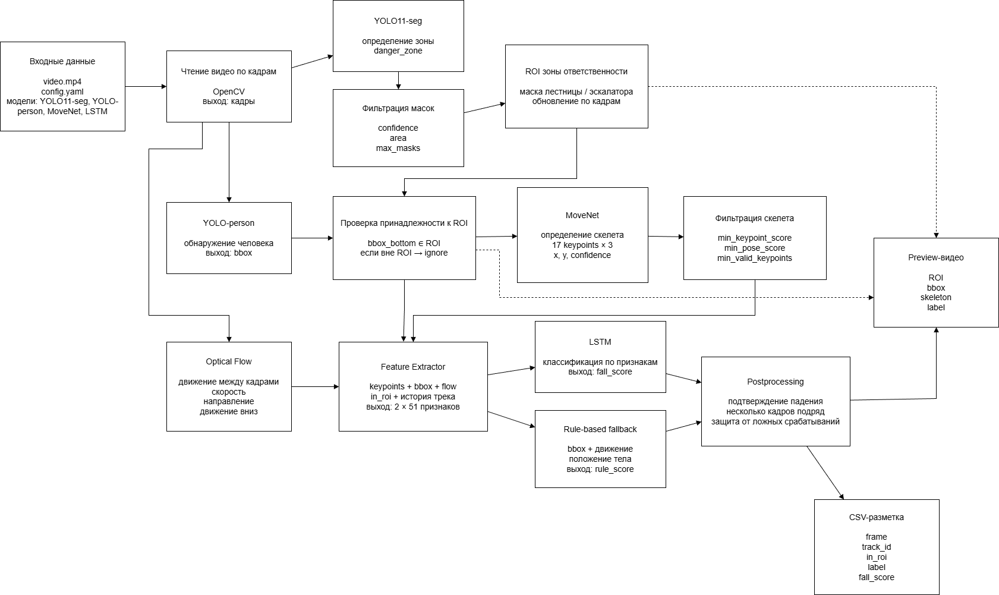

# Fall-Detection
Проект предназначен для автоматической разметки CCTV-видео с падениями людей на лестницах и эскалаторах. Система анализирует видео по кадрам, определяет зону ответственности, находит человека, строит скелет, рассчитывает признаки движения и формирует итоговую разметку `fall`, `not_fall` или `ignore`.

## Архитектура системы

Система построена как последовательный пайплайн обработки видео. Сначала входное видео разбивается на кадры. Для каждого кадра определяется зона лестницы или эскалатора, затем выполняется поиск человека, проверка его принадлежности к зоне ответственности, построение скелета и анализ движения. После этого признаки передаются в классификатор и блок постобработки, который формирует финальное решение.

Основные этапы обработки:

1. **Чтение видео** – OpenCV разбивает входное видео на отдельные кадры.
2. **Определение зоны ответственности** – YOLO11-seg выделяет область лестницы или эскалатора как `danger_zone`.
3. **Фильтрация масок** – удаляются слабые и лишние маски по confidence, площади и количеству найденных зон.
4. **Обнаружение человека** – YOLO-person находит человека и возвращает bounding box.
5. **Проверка ROI** – система проверяет, находится ли человек в зоне ответственности по нижней границе bbox.
6. **Построение скелета** – MoveNet определяет 17 ключевых точек тела человека.
7. **Анализ движения** – Optical Flow рассчитывает движение между соседними кадрами.
8. **Формирование признаков** – объединяются keypoints, bbox, in_roi, optical flow и история трека.
9. **Классификация** – LSTM и rule-based fallback оценивают вероятность падения.
10. **Постобработка** – итоговое решение подтверждается несколькими кадрами для защиты от ложных срабатываний.
11. **Сохранение результата** – формируются CSV-разметка и preview-видео.

## Результаты обработки видео

Результаты обработки видео, можно найти в папке output. Например, видео v1_preview.mp4.

## Результаты тестирования

Тестирование проводилось на 10 видео с различными условиями съёмки: нестабильное освещение, обзор с CCTV-камеры, небольшие размеры человека в кадре, перекрытия телом других людей, перилами и элементами эскалатора. Такие условия усложняют построение скелета и повышают вероятность ложных срабатываний или пропуска падения.

| Видео | TP | TN | FP | FN | Accuracy, % | Precision, % | Recall, % |
|---:|---:|---:|---:|---:|---:|---:|---:|
| 1 | 215 | 73 | 14 | 168 | 61.28 | 93.89 | 56.13 |
| 2 | 0 | 282 | 15 | 26 | 87.31 | 0.00 | 0.00 |
| 3 | 3 | 27 | 6 | 0 | 83.33 | 33.33 | 100.00 |
| 4 | 39 | 30 | 0 | 219 | 23.96 | 100.00 | 26.26 |
| 5 | 3 | 31 | 0 | 52 | 39.53 | 100.00 | 5.45 |
| 6 | 129 | 93 | 7 | 39 | 82.83 | 94.85 | 76.78 |
| 7 | 2 | 0 | 0 | 130 | 1.51 | 100.00 | 1.51 |
| 8 | 37 | 68 | 0 | 81 | 56.45 | 100.00 | 31.35 |
| 9 | 0 | 17 | 2 | 0 | 89.47 | 0.00 | 0.00 |
| 10 | 23 | 238 | 98 | 26 | 67.79 | 19.00 | 46.94 |
| **Среднее** | - | - | - | - | **59.35** | **64.11** | **34.44** |

По результатам тестирования средняя Accuracy составила 59.35 %, средняя Precision – 64.11 %, а средняя Recall – 34.44 %. Это показывает, что система часто достаточно уверенно срабатывает при обнаружении падения, но пропускает часть реальных падений. Основная причина пропусков связана с плохим качеством CCTV-видео: человек может быть маленьким, частично перекрытым, плохо отделяться от фона или находиться в нестандартной позе, из-за чего MoveNet не всегда строит корректный скелет.
